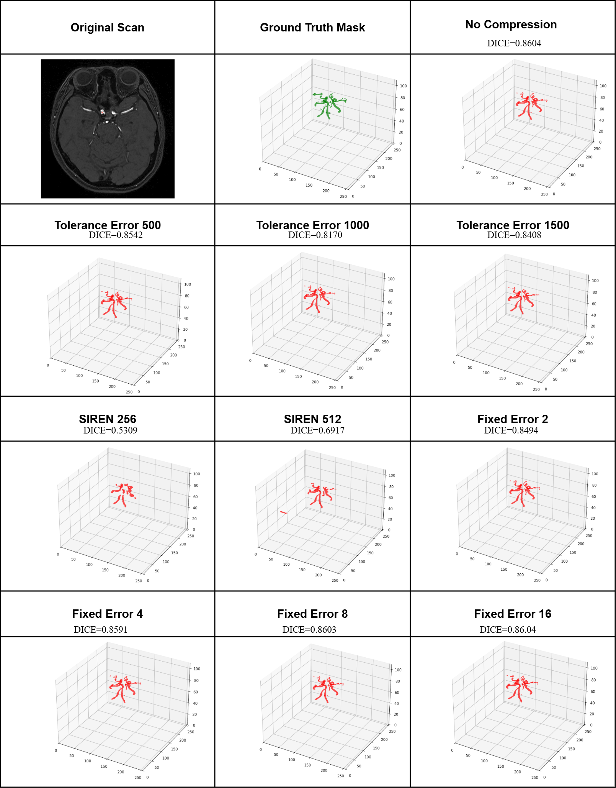

# 3D-cerebrovascular segmentation-Benchmark
A benchmarking framework for efficient 3D cerebrovascular segmentation using ZFP compression and SIREN implicit neural representations, analyzing data reduction versus segmentation fidelity on large-scale medical datasets.

## Overview
This project benchmarks the stability of 3D cerebrovascular segmentation under aggressive compression to address the growing computational and storage demands of modern neuroimaging. With the rapid expansion of high-resolution CT and MRA datasets, efficient compression has become essential for scalable AI research and cloud-based collaboration.
The trade-off between compression efficiency and segmentation fidelity is evaluated on the RSNA Intracranial Aneurysm and TopCoW datasets using state-of-the-art models (nnU-Net v2, U-Mamba, and Mamba VesselNet++). Both classical compression (ZFP) and neural implicit representations (SIREN) are assessed.
Results show that volumetric segmentation is highly robust to lossy compression. ZFP achieves compression ratios up to 50:1 while maintaining Mean Dice > 0.86, whereas SIREN enables extreme compression up to 129:1, with CT showing higher sensitivity to degradation than MRA.
These findings provide practical guidelines for efficient medical data storage, transmission, and cloud-based inference.

## Available Checkpoints
You can download the pretrained model weights from the following link:
[MRA-dataset-RSNA U-Mamba Checkpoints on Hugging Face](https://huggingface.co/Shimaaelbana/U-Mamba_Vessel_Segmentation/blob/main/UMamba_MRA_RSNA.zip)/ 
[CTA-dataset-RSNA U-Mamba Checkpoints on Hugging Face](https://huggingface.co/Shimaaelbana/U-Mamba_Vessel_Segmentation/blob/main/UMamba_CT_RSNA.zip)


🔹 MRA-dataset-RSNA U-Mamba — Best checkpoint trained on MRA cerebrovascular segmentation.

🔹 CTA-dataset-RSNA U-Mamba — Best checkpoint trained on CTA cerebrovascular segmentation.

##  Data Preparation

This study uses the publicly available datasets related to cerebrovascular segmentation. Accessible at [MRA RSNA 2025 Competition](https://www.kaggle.com/datasets/shymaaelbana/vessel-mamba-mra), [CTA RSNA 2025 Competition](https://www.kaggle.com/datasets/shymaaelbana/993-ct-topcow/data)


## Installation

### Prerequisites
- Python 3.11
- CUDA 11.8
- PyTorch 2.2.0

### Step-by-step Setup

**1. Install Python 3.11**
```bash
sudo apt-get update -y
sudo apt-get install -y python3.11 python3.11-dev python3.11-distutils
sudo update-alternatives --install /usr/bin/python3 python3 /usr/bin/python3.11 1
sudo update-alternatives --set python3 /usr/bin/python3.11
```

**2. Install pip for Python 3.11**
```bash
wget https://bootstrap.pypa.io/get-pip.py
python3 get-pip.py
```

**3. Install build tools and dependencies**
```bash
sudo apt-get install -y build-essential python3.11-dev
pip install setuptools wheel packaging ninja --upgrade
```

**4. Install PyTorch (CUDA 11.8)**
```bash
pip install torch==2.2.0 torchvision torchaudio --index-url https://download.pytorch.org/whl/cu118
```

**5. Verify CUDA availability**
```python
import torch
print(f"PyTorch: {torch.__version__}")
print(f"CUDA available: {torch.cuda.is_available()}")
print(f"CUDA version: {torch.version.cuda if torch.cuda.is_available() else 'N/A'}")
```

**6. Install core dependencies**
```bash
pip install numpy==1.26.4 matplotlib==3.7.5
```

**7. Install causal-conv1d and Mamba SSM**
```bash
pip install causal-conv1d==1.2.0.post2 --no-build-isolation
pip install mamba-ssm==1.2.0 --no-build-isolation
```

**8. Clone and install U-Mamba**
```bash
git clone https://github.com/bowang-lab/U-Mamba.git
cd U-Mamba/umamba
pip install -e .
```

## Data Preprocessing

Before training, set the required nnUNet environment variables and run the preprocessing pipeline:
```bash
export nnUNet_raw=""
export nnUNet_preprocessed=""
export nnUNet_results=""
```

Then run planning and preprocessing for your dataset:
```bash
nnUNetv2_plan_and_preprocess -d  -c 3d_fullres -np 1 -npfp 1 --verify_dataset_integrity
```

> Replace `<DATASET_ID>` with your dataset ID (e.g., `701` for MRA-RSNA or `993` for CTA-TopCoW).

---

## Training

To train U-Mamba on your preprocessed dataset, run:
```bash
nnUNetv2_train  3d_fullres 0 -tr nnUNetTrainer
```

> - `<DATASET_ID>`: your dataset ID (e.g., `701` or `993`)  
> - `0`: fold index (change to `1`, `2`, etc. for other folds)  
> - `-tr nnUNetTrainer`: trainer class — replace with `nnUNetTrainerUMambaBot` or `nnUNetTrainerUMambaEnc` for U-Mamba variants

---

## Inference

To run prediction on your test set using a trained checkpoint:
```bash
nnUNetv2_predict \
  -i  \
  -o  \
  -d  \
  -c 3d_fullres \
  -f 0 \
  -tr nnUNetTrainerUMambaBot \
  --disable_tta
```

> - `-i`: folder containing test images (e.g., `imagesTs/`)  
> - `-o`: folder where predictions will be saved  
> - `-d`: dataset ID  
> - `-f`: fold index used during training  
> - `--disable_tta`: disables test-time augmentation for faster inference  
> - `-tr`: trainer class used during training (must match)


## Inference
The following figure shows the visualization of the MambaVesselNet output.  
It represents one slice from the 3D cerebrovascular volume to illustrate the model’s segmentation performance.



## 📄 Citation
If you use this repository, please cite our paper:

> *arXiv preprint [arXiv:2510.03769](https://arxiv.org/abs/2510.03769), 2025.*

```bibtex
@article{elbana2025efficiency,
  title={Efficiency vs. Efficacy: Assessing the Compression Ratio-Dice Score Relationship through a Simple Benchmarking Framework for Cerebrovascular 3D Segmentation},
  author={Elbana, Shimaa and Kamal, Ahmad and Ali, Shahd Ahmed and Al-Kabbany, Ahmad},
  journal={arXiv preprint arXiv:2510.03769},
  year={2025}
}
```
If you have any questions about our project, feel free to contact me by email at shimaa.elbanaa@aiet.edu.eg or alkabbany@ieee.org

## Acknowledgements

We thank the authors of [Mamba](https://github.com/state-spaces/mamba) for making their valuable code publicly available.


